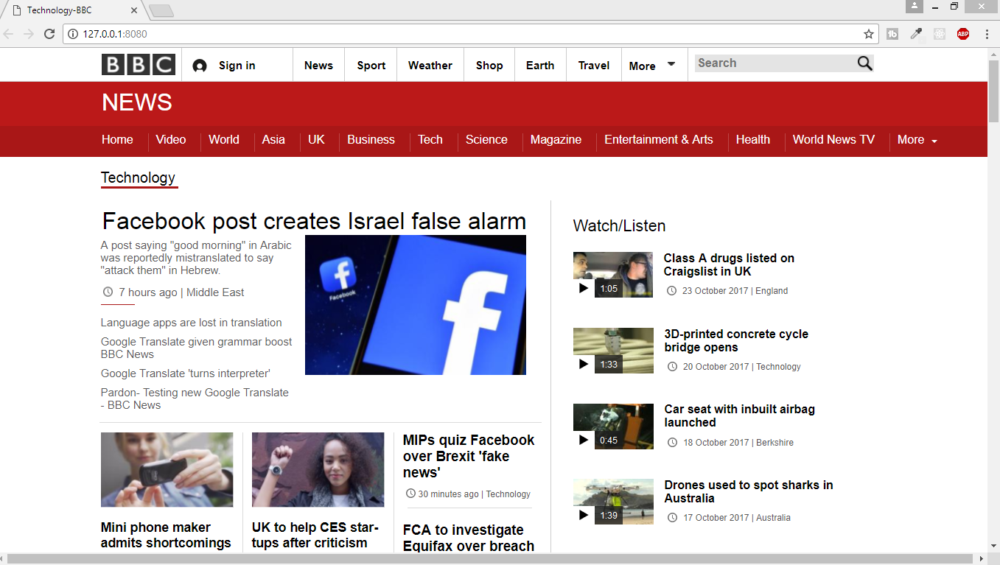

# BBC News Website - Technology Part
This project is the complete technology part of the BBC News Website. 

## Built with
- HTML5
- CSS3

This project is the output of my hard working. To develop your skill, there is no way without practicing. I developed this
for practicing purpose.

- [Facebook](https://facebook.com/)
- [Twitter](https://twitter.com/)
- [Linkedin](https://www.linkedin.com/in/)
